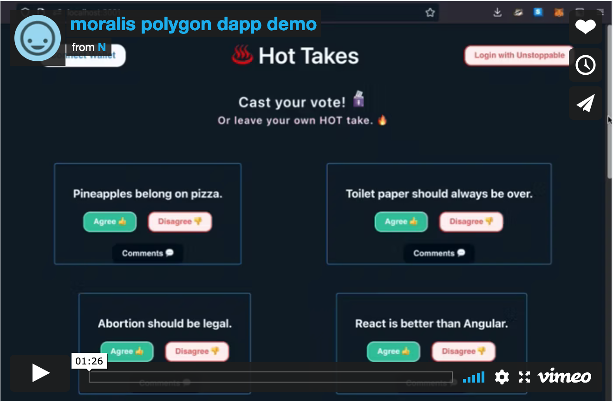

# Hot Takes ♨️

## Installation 
1. Clone this repository
2. Run **`npm install`** to install all dependencies
3. Run **`npm start`** to start the React app on localhost:3000

 

## Configure your environment
Configure the **`.env.example`** files in project root dir + ./src/smartcontract.  Rename to **`.env`**. Restart the server to apply changes.

 

## One-Liner
> See what's sizzling ♨️. Can you take the heat? ⽕🔥 ~ 🌶 🥵
 

## About the project
Controversial opinions up for debate. Tamper-proof polls with results recorded on the public ledger. Cast a vote on existing polls. Or post a hot take and gather insights on public sentiment.

 

## Video Demo

 

## GIF Demos
 

#### 🦊 Metamask Connect (with Moralis)
 

#### *️⃣ Login with Unstoppable Domains

 
"For Login with Unstoppable integrations, users must use Polygon Mainnet or Ethereum Mainnet as the network for the domain." [<a href='https://docs.unstoppabledomains.com/login-with-unstoppable/login-integration-guides/login-with-popup/' target='_blank'><strong>source</strong></a>]. Free Polygon test domain doesn't work? 

#### 🗳 Vote, Comment, Debate

 

<!-- <table width='300'>
    <tr>
        <td width='250' align='center'>  </td>
        <td width='300'>  </td>
        </tr>
</table> -->

#### 🔐 Moralis Connected Server

#### ❓Question
If administrator, moderator, or developer can edit and delete user data + requests in Moralis backend server, does this not make the app centralized under the control/influence of a single developer/entity? User data is not secured in a trustless storage if it can be manipulated?

 

## Challenges
### Learning Web3 blockchain be like:
<table>
    <tr>
        <th width='300' align='left'>  </th>
        <th width='300' align='left'>  </th>
        <th width='300' align='left'>  </th>
    </tr>
</table>

### Before & After
<table>
    <tr>
        <th width='200' align='left'>  </th>
        <th width='200' align='left'>  </th>
    </tr>
</table>

<table>
    <tr>
        <td width='300px' align='left'>
            Source: GIFs [<a href='https://cdn.dribbble.com/users/221008/screenshots/1685845/sisyphus.gif' target='_blank'>1</a>][<a href='https://cdn.dribbble.com/users/1554124/screenshots/4125105/6.sisyphus_small.gif' target='_blank'>2</a>][<a href='https://media.giphy.com/media/PWfHC8ogZpWcE/giphy.gif' target='_blank'>3</a>][<a href='https://i.makeagif.com/media/10-07-2015/hiIhDx.gif' target='_blank'>4</a>][<a href='https://www.clipartbay.com/clipart/12838' target='_blank'>5</a>][<a href='https://www.clipartbay.com/clipart/12846' target='_blank'>6</a>]
        </td>
    </tr>
</table>

 

## 🔗 Links
Smart contract deployed on Polygon Testnet: 
https://mumbai.polygonscan.com/address/0xfC6b9abf3B8139edeEd5CF94162ffA7f72898c8d 

Unstoppable test domain transaction: 
https://mumbai.polygonscan.com/tx/0x5c43dbc9d67d77250893cb284ba8687ba4f2f37439958e93f201d372bb49e443

 

## 📧 Contact
<a href='https://llclick.com/67tztwf0' target='_blank'>Contact Information</a>

 	

## 🔰 Resources
<a href="https://github.com/MoralisWeb3/youtube-tutorials/tree/main/FirsrDapp-Final" target="_blank"><strong>MoralisWeb3 First Dapp Tutorial</strong></a>  

<a href="https://docs.unstoppabledomains.com/login-with-unstoppable/get-started-login/integration-pathways/" target="_blank"><strong>Unstoppable Login Integration</strong></a>

 

